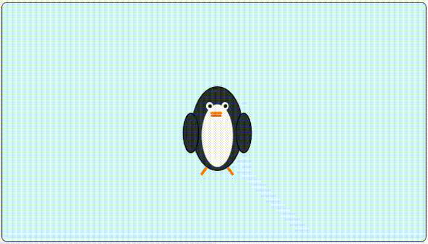

# Tutorials Overview

Welcome to the **MicroPython Tutorials**! 

This section is designed to take you from a complete beginner to a confident creator. Whether you are building your very first animated character or coding an interactive game, these lessons will guide you step-by-step.

## How to Use This Section

The tutorial series is split into two distinct types of lessons to help you build both knowledge and practical skills:

### 1. Skill Tutorials 🛠️
* **What they are:** Focused, bite-sized lessons that explain **how individual blocks and functions work**.
* **When to use them:** Read these first when you want to learn a specific concept (like how the X/Y coordinate grid works, how to use `sleep()`, or how to play sounds).
* **Key Goal:** Understand the *why* and *how* behind the code.

### 2. Project Tutorials 🚀
* **What they are:** Full, hands-on guided projects where you **combine multiple skills** to create a complete game or animation.
* **When to use them:** Follow these step-by-step to construct full projects from scratch—from setting up sprites and stage backdrops to writing complete MicroPython scripts.
* **Key Goal:** Put your knowledge into action and create something fun!

---

## Recommended Learning Path

For the best experience, we recommend completing the tutorials in order:

1. **[Project 1-1: The Dancing Penguin](tutorial/projects/tut1.md)**  
    > {width=inherit}
   * **Focus:** Movement, costume changes, sound effects, and loops (`for` and `while`).
   * **Outcome:** Build an animated penguin performing a synchronized jump sequence.

2. **[Project 1-2: PopHorse - Clicker Game](tutorial/projects/tut1.md)**  
    > {width=inherit}
   * **Focus:** Event-driven programming (`when clicked`), speech bubbles (`say`), and rapid reactions.
   * **Outcome:** Build an interactive PopCat-style clicker game.

3. **[Project 1-3: Telling Jokes with MicroPython](tutorial/projects/tut1.md)**  
    > {width=inherit}
   * **Focus:** Multi-sprite coordination, timed dialogue, physics jumps, and rotation loops (`turn`).
   * **Outcome:** Create a fun animated conversation between two characters on stage.

---

> 💡 **Tip for Creators:** Feel free to revisit any **Skill Tutorial** while working on a project if you ever need a quick refresher on how a specific block works!