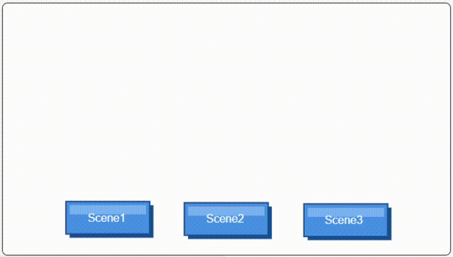
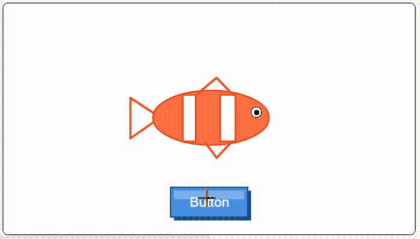

# Project Tutorials Index

Welcome to the **Project Tutorials** collection! Here, you will apply the coding skills you have learned to build complete, interactive games and animations in MicroPython.

Each project provides step-by-step instructions—from adding sprites and backdrops to writing and testing your final code.

---

## 📚 Projects List

| Preview GIF | Project |
| :---: | :--- |
| {width="600"} | **[Project 1-1: The Dancing Penguin](tut1.md)** Create an animated penguin that dances to sound effects and music on stage. |
| {width="600"}  | **[Project 1-2: PopHorse - Clicker Game](tut2.md)** Build a PopCat-style interactive game where clicking the horse triggers sounds and reactions. |
| {width="600"}  | **[Project 1-3: Telling Jokes with MicroPython](tut3.md)** Program a humorous dialogue between two characters where one jumps and the other rolls off-screen. |
| {width="600"}  | **[Project 1-4: Scene Switcher Menu](tut4.md)** Program a humorous dialogue between two characters where one jumps and the other rolls off-screen. |
| {width="600"}  | **[Project 1-5: Magical Fish Changing Build](tut5.md)** an interactive scene where clicking a button magically cycles a fish character through custom color costumes. |
---

## 🛠️ How to Complete a Project

1. **Follow the Setup:** Begin by creating your workspace, adding your characters (sprites), and selecting a backdrop.
2. **Understand the Building Blocks:** Review the individual skills and code snippets used in the project.
3. **Combine the Code:** Assemble the full script and run it on your stage.
4. **Try the Challenge:** Test your understanding by attempting the bonus customization challenges at the end of each project!

---

> 👈 Choose a project from the table above or the sidebar menu to get started!