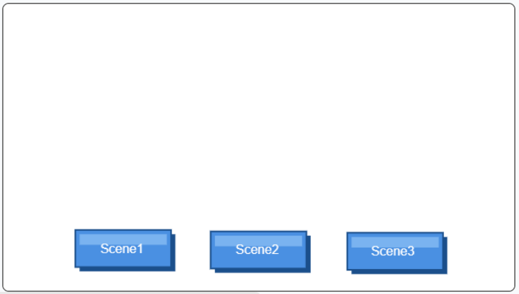
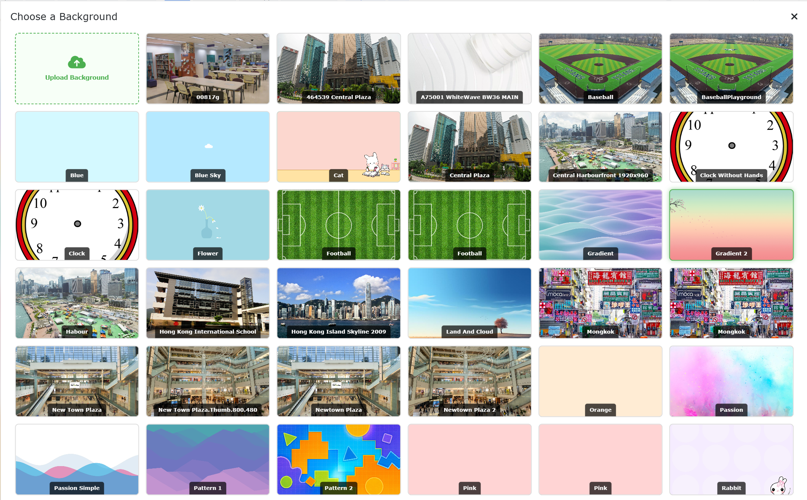
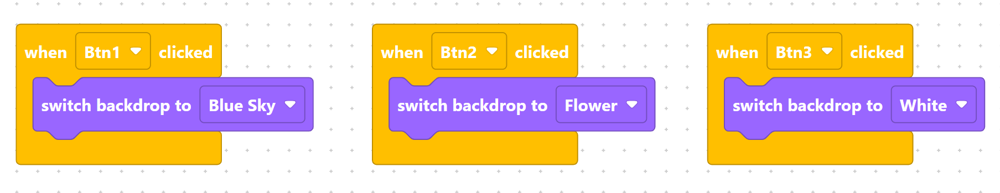

> {width=inherit}

## 📌 Project Overview
In this project, you will build an interactive **Scene Switcher Menu**. By using event-driven programming, you will connect on-stage button clicks (`Btn1`, `Btn2`, `Btn3`) to immediate backdrop changes (`Blue Sky`, `Flower`, `White`). This technique is fundamental for creating start menus, level selection screens, and multi-scene storytelling projects!

Learn how to create an interactive scene selector menu using button triggers to dynamically switch stage backdrops in MicroPython!

## What You Are Building

You will create an interactive **Scene Switcher Interface** featuring three custom clickable buttons on the stage:

* **Sky Button (`Btn1`):** Instantly changes the stage to the **Blue Sky** backdrop.
* **Flower Button (`Btn2`):** Switches the scene to the **Flower** field.
* **White Button (`Btn3`):** Clears the stage back to a simple **White** background.

## Step 1 - Add Three Buttons
Open the Object Library and add three button sprites to your stage. Rename them to **`Btn1`**, **`Btn2`**, and **`Btn3`**.

> {width=inherit}

## Step 2 - Customize Button Text
Go to the **Character / Costume** edit page for each button and use the text tool to customize the labels on top of the buttons (e.g., *Sky*, *Flower*, *White*).

> {width=inherit}

## Step 3 - Choose Your Backdrops
Open the Backdrop Gallery and pick 3 stage backdrops that match your button labels (for example: **`Blue Sky`**, **`Flower`**, and **`White`**).

> {width=inherit}

## Step 4 - Code the Button Events
Program each button to switch to its corresponding backdrop when clicked:

> {width=inherit}

## ⚠️ Common Mistakes to Avoid

### 1. Selecting the Wrong Event Trigger
* **The Error:** Attaching `switch_backdrop()` to a generic `Start` block instead of the button's click event.
* **The Fix:** Make sure your code is placed inside the correct event listener function (e.g., `when_Btn1_clicked()`) so it only runs when that specific button is clicked.

---

### 2. Editing Text on the Wrong Sprite
* **The Error:** Changing costume text without verifying which button sprite you currently have selected in the editor.
* **The Fix:** Always click on the target sprite in the Object List *before* opening the **Character / Costume** edit page to ensure you are modifying the right button.