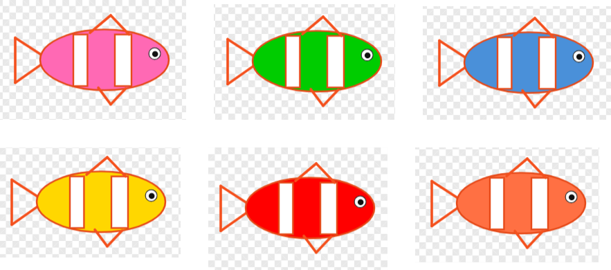
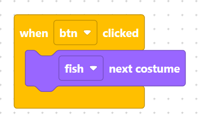

> {width=inherit}

Learn how to create an interactive button that cycles through a character's custom costumes every time it is clicked in MicroPython!

## Project Overview
In this project, you will build an interactive **Magical Fish Changing** scene. By linking an on-stage button click event to a fish sprite, you will trigger costume switches that change the fish's color every time the button is pressed. This project reinforces button triggers, costume editing, and sequential frame animation.

## Learning Objectives
* **Sprite Setup & Layout:** Add and position multiple objects on stage.
* **Costume Painting:** Create 5 additional color variations for a single character.
* **Event-Driven Animation:** Use `next_costume()` triggered by a button click event.

## What You Are Building

You will build a dynamic scene with a fish character and a click button:

* **Button Sprite:** Detects user clicks on stage.
* **Fish Sprite:** Contains 6 total costume variations (1 original + 5 custom colored versions).
* **Interactive Behavior:** Every time the user clicks the button, the fish cycles to its next color pose!

## Step 1 - Add Objects: Button and Fish
Open the Object Library and add two sprites to your project:
1. Add a **Button** sprite and name it **`Btn`**.
2. Add a **Fish** sprite and name it **`Fish`**.

> {width=inherit}
> {width=inherit}

## Step 2 - Position the Button and Fish
Drag the objects on the stage to arrange them cleanly:
* Place the **`Fish`** near the center of the stage.
* Place the **`Btn`** near the bottom corner so it acts as a clickable control button.
* Resize the **Fish**.

> {width=inherit}

## Step 3 - Draw 5 Custom Fish Costumes
1. Select the **`Fish`** sprite from your object list.
2. Go to the **Character / Costume** editor panel.
3. Duplicate or create 5 new costumes, using the paint bucket tool to change the color of the fish for each costume (giving you 6 costumes in total).

> {width=inherit}

## Step 4 - Program the Button Event
Select **`Btn`** and add the code so that whenever the button is clicked, it commands **`Fish`** to switch to its next costume:

> {width=inherit}

## ⚠️ Common Mistakes to Avoid

1. Programming the Fish Instead of the Button
- The Error: Placing the click event code on the **`Fish`** sprite instead of the **`Btn`** sprite.

- The Fix: Ensure you select **`Btn`** in the Object List before adding the `when_Btn_clicked` event block.

2. Modifying the Wrong Sprite's Costumes
- The Error: Painting new costumes on Btn instead of Fish.

- The Fix: Double-check that Fish is highlighted before opening the Costume Editor. 
  
---

> Challenge: Try adding a sound effect (`start_sound("pop")`) every time the button is clicked to make the color change feel more magical!