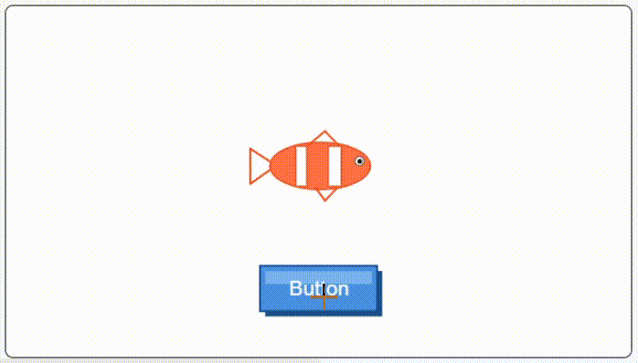
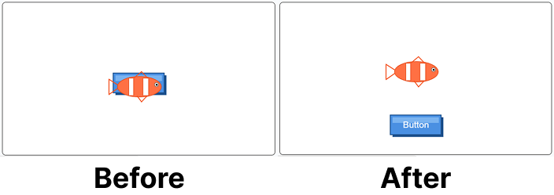
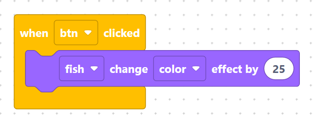

> {width=inherit}

Learn how to use graphic effect blocks to change a character's color dynamically using code instead of drawing multiple costumes!

## Project Overview
In this project, you will rebuild the Magical Fish app using a much more efficient coding technique. Instead of manually drawing multiple costumes, you will use the graphic effect function `change_effect("color", 25)` to dynamically shift the fish's hue in real time whenever the button is clicked.

## Learning Objectives
* **Graphic Effects:** Understand how to modify a sprite's visual appearance using code parameters.
* **Code Efficiency:** Compare costume-based animation versus graphic effect manipulation.
* **Event Control:** Trigger sprite effect changes from a separate button object.

## What You Are Building

You will create a simplified version of the Magical Fish scene that produces infinite color shifts without extra costumes:

* **Button Sprite (`btn`):** Detects user click events.
* **Fish Sprite (`fish`):** Automatically shifts its hue using the built-in color effect engine.

## Step 1 - Add Objects: Button and Fish
Open the Object Library and add two sprites to your stage:
1. Add a **Button** sprite and name it **`btn`**.
2. Add a **Fish** sprite and name it **`fish`**.

> {width=inherit}
> {width=inherit}

## Step 2 - Position the Sprites
Arrange your objects on stage:
* Place **`fish`** near the center of the stage.
* Place **`btn`** near the bottom corner so it acts as a control button.

> {width=inherit}

## Step 3 - Program the Color Effect Event
Select **`btn`** and program it to change the color effect of **`fish`** by **`25`** every time it is clicked:

> {width=inherit}

