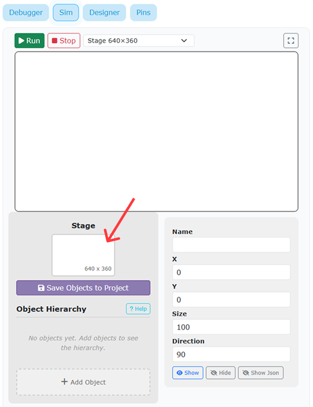
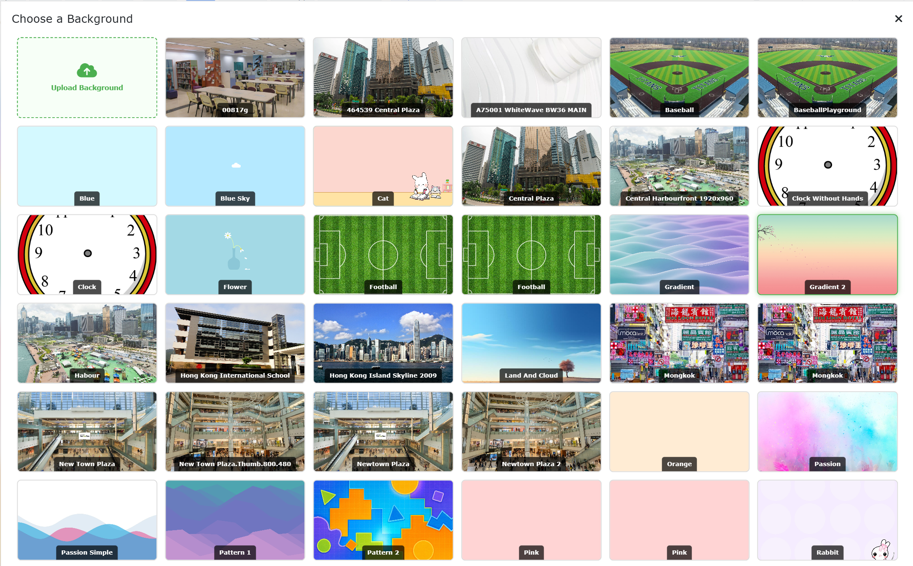
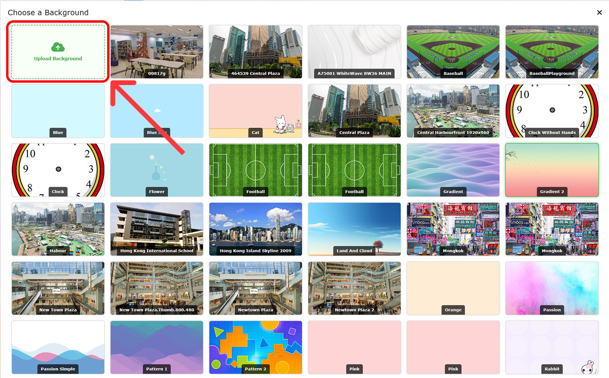

Learn how to customize your stage by choosing a backdrop from the built-in library or uploading your own custom image!

## Step 1 - Open the Backdrop Library
The default stage background can be too plain! Click the **Stage Photo Button** in the panel to open the backdrop gallery.

> {width=inherit}

## Step 2 - Choose a Built-in Backdrop
Browse the gallery and click on any backdrop to apply it to your stage immediately. 

> {width=inherit}

---

# How to Use Your Own Background
If you want to use a custom picture from your computer:

1. Hover over the **Stage Photo Button** without clicking it.
2. Click the **Upload Backdrop** option from the popup menu.
3. Select an image file (`.jpg` or `.png`) from your computer to set it as your stage background!

> {width=inherit}
