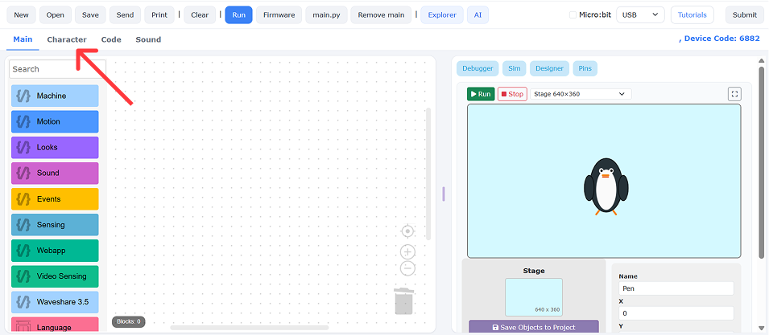
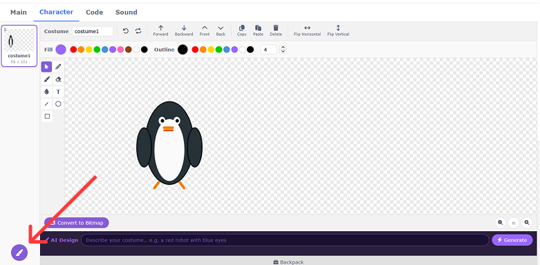

# How to Draw & Edit Costumes

Learn how to create custom costume frames for your character and switch between them using MicroPython code!

---

## Step 1 - Draw New Costumes

1. Click **"Character"** in the top-left corner of the editing panel.

> {width=inherit}

2. Click the **Paint Brush** button in the bottom-left corner to create a blank costume canvas.

> {width=inherit}

3. Use the drawing tools to create additional costume poses for your character. See the examples below:

> {width=inherit}

---

## Step 2 - Switch Costumes with MicroPython

There are 2 ways to change costumes using code:

1. **`switch_costume("costume1")`** – Switches directly to a specific costume by its exact name.

> {width=inherit}

1. **`next_costume()`** – Cycles automatically to the very next costume in your list.

> {width=inherit}

---

> 💡 **Tip:** Keep costume names simple (e.g., `pose1`, `pose2`) so they are easy to reference in your Python scripts!