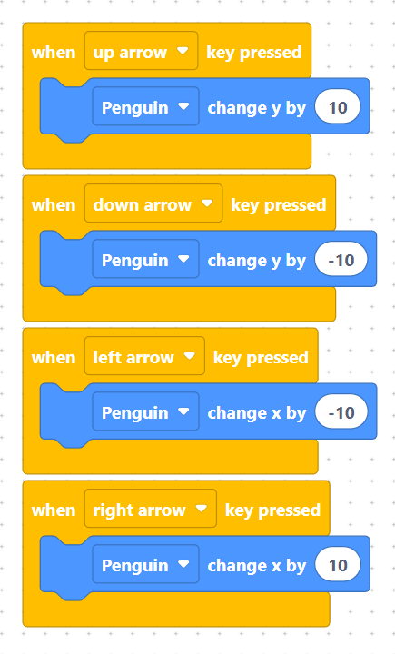

# Skill 5: How to Control Characters with Keyboard Controls

Learn how to listen for key press events and update sprite X and Y coordinates to make your characters move across the stage!


## Step 1 - Add & Name Your Character
1. Open the Object Library and add a character to your stage (such as the **Penguin**).
2. Change its name to **`Penguin`** in the object settings panel.

> {width=inherit}
> {width=inherit}


## Step 2 - Code the Directional Movement
To move a character, listen for key presses and change its **X coordinate** for horizontal movement or **Y coordinate** for vertical movement:

* **Up Arrow:** Increases Y coordinate (`change_y_by(10)`).
* **Down Arrow:** Decreases Y coordinate (`change_y_by(-10)`).
* **Left Arrow:** Decreases X coordinate (`change_x_by(-10)`).
* **Right Arrow:** Increases X coordinate (`change_x_by(10)`).

> {width=inherit}


### MicroPython Code Equivalent

```python
# Move Up
def when_up_arrow_key_pressed():
    Penguin.change_y_by(10)

# Move Down
def when_down_arrow_key_pressed():
    Penguin.change_y_by(-10)

# Move Left
def when_left_arrow_key_pressed():
    Penguin.change_x_by(-10)

# Move Right
def when_right_arrow_key_pressed():
    Penguin.change_x_by(10)

```

## Step 3 - Try Customizing Your Key Binds
Try changing the input keys inside the dropdown menu from arrow keys to **`W`**, **`A`**, **`S`**, and **`D`** to support WASD movement controls, or pick any other keys you like for your game!

> 💡 Tip: Remember that X moves side-to-side (left/right) and Y moves up-and-down. Positive numbers move right or up, while negative numbers move left or down!

## Common Mistakes to Avoid

### 1. Controlling the Wrong Object Name
* **The Error:** When your stage has multiple objects, it is easy to accidentally select the wrong object name inside the movement block (e.g., controlling `Background` instead of `Penguin`).
* **The Fix:** Double-check the target object dropdown in every movement block to ensure it matches the exact name of the sprite you want to control!

### 2. Confusing X and Y Axes
* **The Error:** Swapping `change_x_by` and `change_y_by`, causing your character to move left/right when pressing up/down.
* **The Fix:** Remember that **Y** controls vertical movement (Up/Down) and **X** controls horizontal movement (Left/Right).

### 3. Mixing Up Positive and Negative Values
* **The Error:** Pressing Down moves the sprite up, or pressing Left moves the sprite right.
* **The Fix:** Always use positive numbers for Up and Right (`10`), and negative numbers for Down and Left (`-10`).